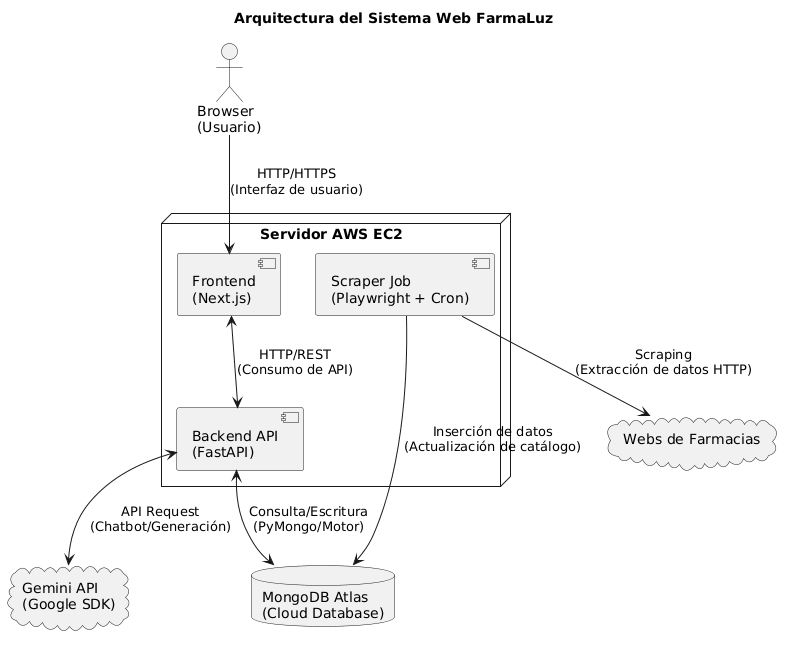
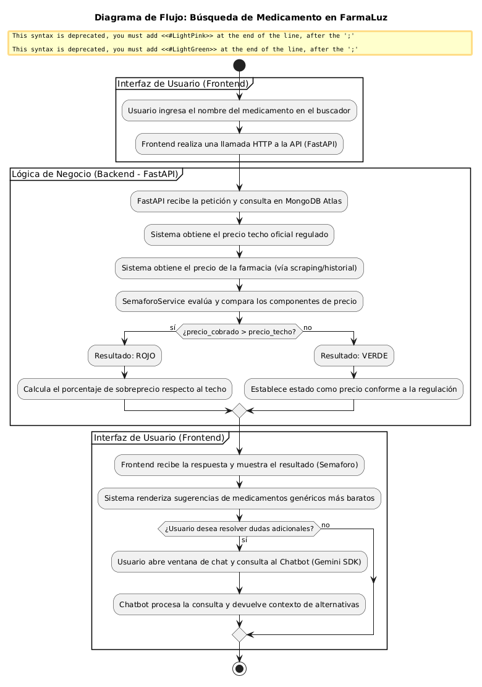
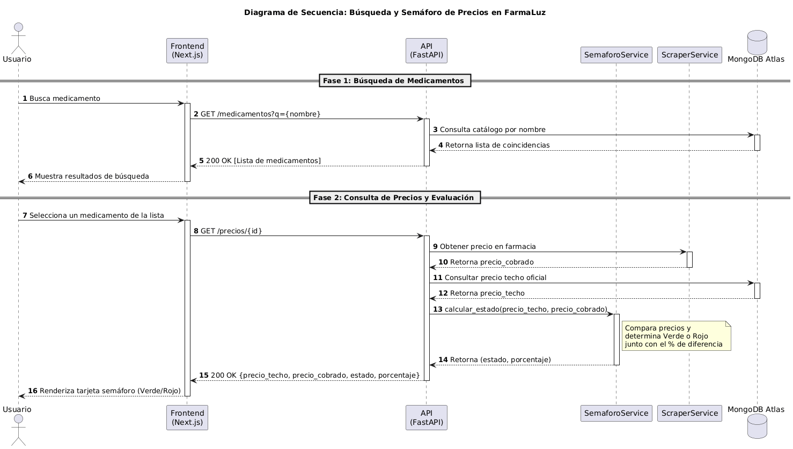

# Sprint 0 — Día 1 — Documentación de Avance

**Responsable:** Luis Paspuezán — Backend + DevOps + Líder
**Fecha:** 19 de junio 2025

## Qué se hizo

### Tarea 1 — Repositorio GitHub
- Repositorio público creado: `github.com/LUIS1519Q/farmaluz`
- Ramas creadas: `main`, `develop`, `feature/sprint0`
- Estructura de carpetas en `develop`: `/docs`, `/docs/diagramas`, `/backend`, `/frontend`, `/scraper`, `/chatbot`, `/tests` (con `.gitkeep` en carpetas vacías)
- `FarmaLuz_DocBase_v2.1.docx` subido a `/docs`
- `README.md` completado con descripción, stack tecnológico y equipo

### Tarea 2 — Diagramas PlantUML
- `diagrama_arquitectura.png` — arquitectura general del sistema (Frontend, Backend, MongoDB, Scraper, Chatbot, EC2)
- `diagrama_flujo_endtoend.png` — flujo completo de búsqueda de medicamento
- `diagrama_secuencia_busqueda.png` — diagrama de secuencia del proceso de búsqueda
- Generados con prompts en Gemini/ChatGPT, renderizados en plantuml.com, subidos a `/docs/diagramas`

### Gestión adicional (Líder de proyecto)
- Workspace de Huly creado: `FarmaLuz`, identificador de proyecto `FLZ`
- 5 milestones de Huly mapeados a las fechas de cada sprint

## Decisiones técnicas

- GitFlow como modelo de ramas: `main` (estable), `develop` (integración), `feature/*` (trabajo en curso)
- Huly se usa exclusivamente para gestión de tareas (Backlog → Todo → In Progress → Done); la evidencia y documentación técnica vive en `/docs` del repositorio

## Estado del equipo (Sprint 0, Día 1)

| Integrante | Entregable | Estado |
|---|---|---|
| Sanchez Jordan | CSV oficial + Modelo MongoDB + diagrama colecciones | Completo |
| Vela Vanessa | Prompt base + capturas Gemini + diagrama flujo chatbot | Completo |
| Chicaiza Alex | Flujo navegación + Manual Identidad Visual + 5 pantallas + StyleGuide Figma | Pendiente |
| Males Mateo | ERS (10 RF) + 10 Casos de Uso + diagrama PlantUML | Pendiente |

## Pendientes detectados

- Confirmar que Chicaiza y Males suban su evidencia de Sprint 0 a `/docs` y Huly
- Issues fragmentados FLZ-28/29/30 en Huly deben fusionarse en uno solo
## Evidencia

### Diagrama de Arquitectura

### Diagrama de Flujo End-to-End

### Diagrama de Secuencia — Búsqueda de Medicamento
