# Sprint 1 — Documentación de Avance

**Responsable:** Luis Paspuezán – Backend + DevOps + Líder

---

## Día 1 — 19/20 de junio 2025

### Qué se hizo
- Conexión SSH a la instancia EC2 establecida
- Dependencias instaladas en el servidor: python3-pip, python3-venv, nginx, git
- Proyecto FastAPI creado en local (`~/Desktop/farmaluz/backend`)
- Entorno virtual local creado y activado
- Endpoint raíz `GET /` probado en `127.0.0.1:8000` → `{"status":"OK"}`
- `requirements.txt`, `.gitignore`, `.env.example` generados
- Todo pusheado a `feature/sprint0`

### Evidencia
Ver `docs/capturas/Backend-Devops/sprint1/dia1_endpoint_local.png`, `dia1_push_github.png`

---

## Día 2 — 21 de junio 2025

### Qué se hizo
- Repositorio clonado en el servidor EC2 (`~/apps/farmaluz`)
- Entorno virtual creado en el servidor + dependencias instaladas (`pip install -r requirements.txt`)
- FastAPI probado manualmente con `uvicorn main:app --host 0.0.0.0 --port 8000`
- Verificado acceso público vía IP del EC2: `http://18.225.130.85:8000`
- Nginx configurado como proxy reverso (puerto 80 → 8000), permitiendo acceso sin especificar puerto
- Creados endpoints mock en `routers/medicamentos.py`:
  - `GET /medicamentos` — lista de medicamentos (datos simulados, pendiente integración con MongoDB de Sanchez)
  - `GET /medicamentos/{id}` — detalle de un medicamento
- Endpoints conectados en `main.py` vía `app.include_router(medicamentos.router)`
- Verificación final en documentación automática de FastAPI: `http://18.225.130.85/docs`

### Decisión técnica
Se usaron datos mock para `/medicamentos` porque Sanchez aún no termina los CRUDs de MongoDB (previsto en el documento oficial del sprint). Se reemplazarán por datos reales en cuanto esté disponible la conexión a MongoDB Atlas.

### Evidencia
Ver `docs/capturas/Backend-Devops/sprint1/` — capturas: clone en EC2, venv + dependencias, uvicorn corriendo, navegador con IP pública, nginx status, endpoint /medicamentos, pantalla /docs

### Entregables completados
- ✅ Instancia EC2 corriendo Ubuntu 24.04
- ✅ FastAPI desplegado y accesible públicamente
- ✅ Nginx configurado (puerto 80)
- ✅ Endpoints GET /medicamentos y GET /medicamentos/{id} funcionando
- ✅ Documentación automática visible en /docs

### Evidencia — Día 1

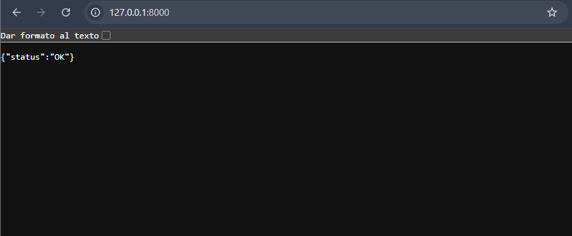

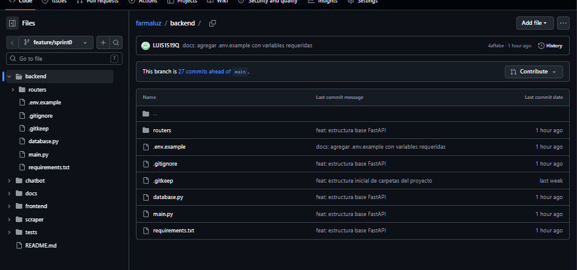

### Evidencia — Día 2

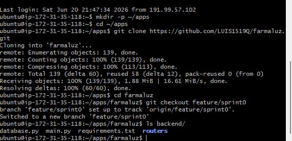

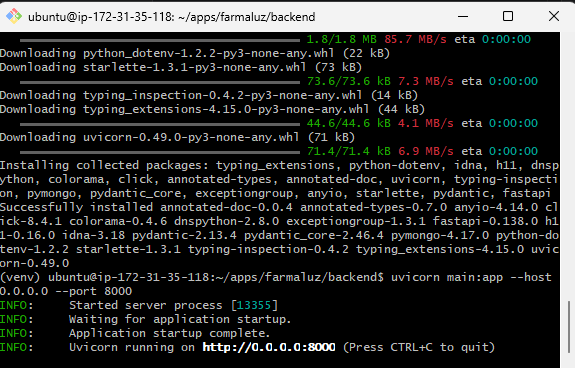

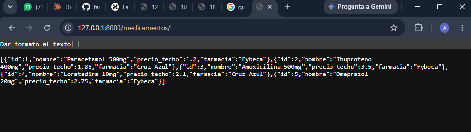

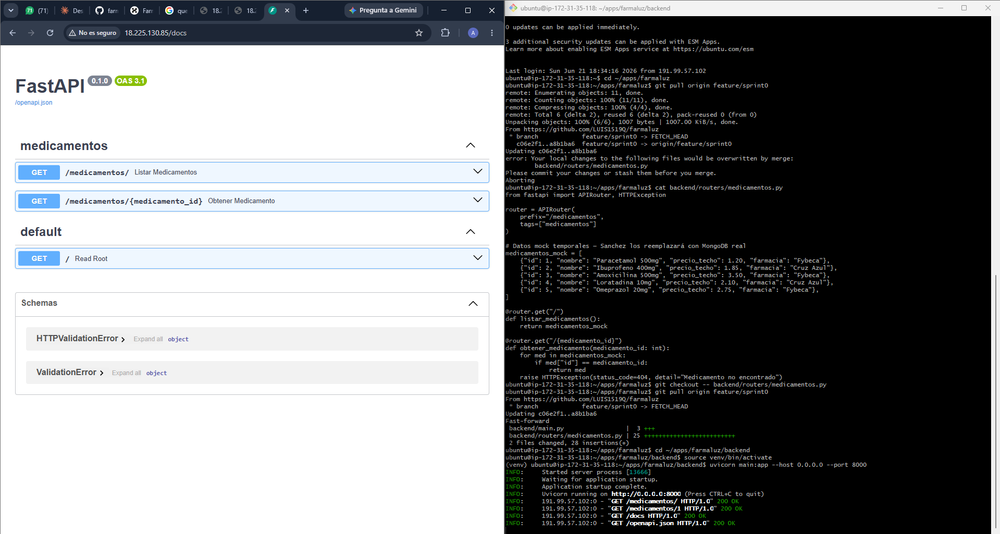

---

## Día 3 — 22 de junio 2025

### Qué se hizo
- Configurado `farmaluz.service` en systemd para que uvicorn corra como servicio persistente
- Verificado que el servicio sobrevive el cierre y reapertura de SSH (`active (running)`)
- Agregado `MONGO_URI` al `.env` del EC2 con las credenciales de MongoDB Atlas (coordinado con Sanchez)
- Creado `.github/workflows/deploy.yml` con GitHub Actions CI/CD
- Configurados secrets en GitHub: `EC2_HOST` y `EC2_SSH_KEY`
- Workflow disparado automáticamente al hacer push a `main` → conecta por SSH al EC2, hace `git pull origin main` y reinicia el servicio
- Merge completado: `feature/sprint0` → `develop` → `main`
- Confirmado con Sanchez que `MONGO_URI` está activo y routers de `medicamentos` y `precios` integrados en `main.py`
- FLZ-30, FLZ-31 y FLZ-32 marcados como Done en Huly

### Decisión técnica
El trigger del CI/CD se configuró en `main` (no en `feature/sprint0`) siguiendo la práctica GitFlow estándar: solo el código aprobado y mergeado a `main` se despliega al servidor. Las ramas `feature/*` y `develop` no disparan ningún deploy.

### Evidencia — Día 3

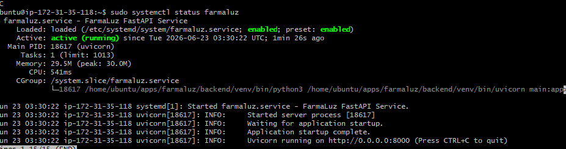

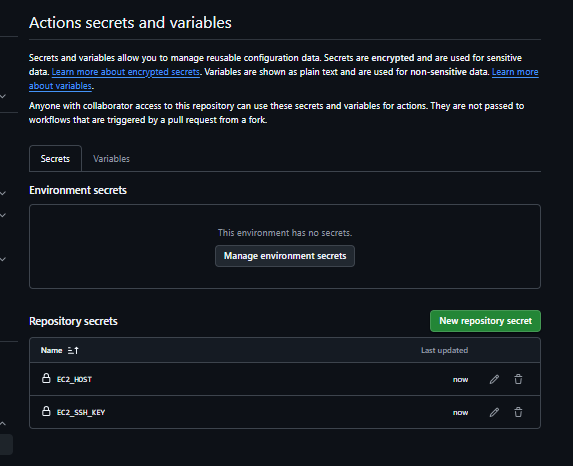

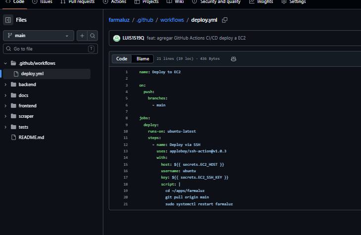

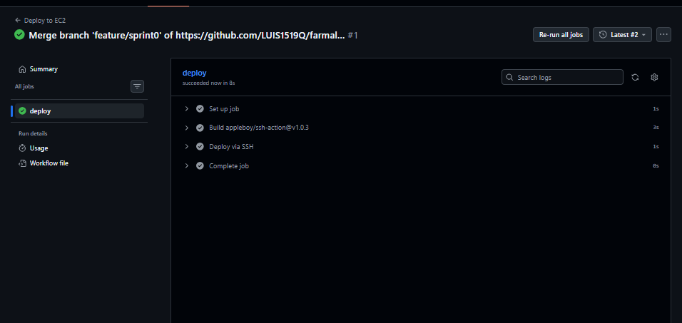

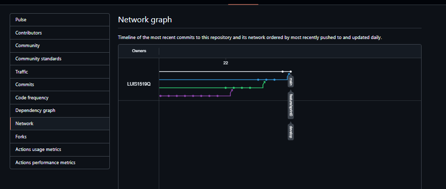

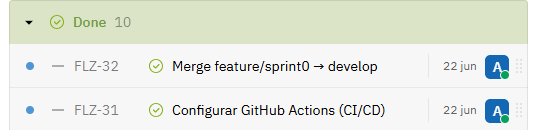

### Entregables completados
- ✅ Uvicorn corriendo como servicio systemd persistente
- ✅ MONGO_URI configurado en `.env` del EC2
- ✅ GitHub Actions CI/CD funcionando (trigger en `main`)
- ✅ Merge `feature/sprint0` → `develop` → `main` completado
- ✅ FLZ-30, FLZ-31, FLZ-32 cerrados en Huly