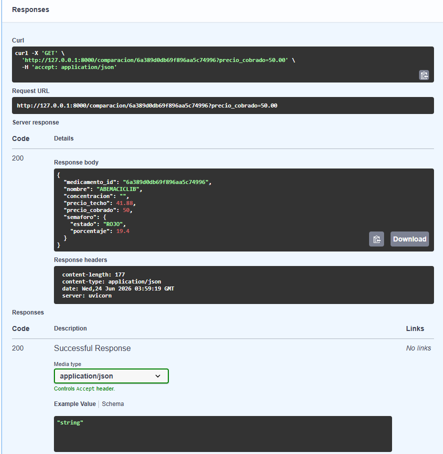

# Sprint 2 — Día 1 | Paspuezán Luis | Backend + DevOps

**Fecha:** Martes 23 de junio de 2026  
**Rama:** `feature/sprint2`

## ¿Qué hice hoy?

- Creé la rama `feature/sprint2` desde `develop`
- Implementé `backend/services/semaforo_service.py` con la función `calcular_semaforo()` que compara el precio cobrado contra el precio techo legal (CNFRPM/ARCSA) y retorna ROJO con porcentaje de sobreprecio o VERDE si está dentro del límite
- Creé el endpoint `GET /comparacion/{medicamento_id}` en `backend/routers/comparacion.py` que consulta la colección `medicamentos` de MongoDB Atlas y llama al semáforo
- Registré el router en `backend/main.py`
- Creé `.gitignore` (faltaba en el proyecto)
- Configuré el `.env` local y en EC2 con la `MONGODB_URI` correcta de Atlas
- Corregí el `WorkingDirectory` y el comando del servicio `systemd` para que use `backend.main:app` desde la raíz del proyecto
- Instalé `google-generativeai` en el venv local y en EC2
- Desplegué y verifiqué el funcionamiento en EC2

## Decisiones técnicas

- Se decidió leer el `precio_techo` directamente de la colección `medicamentos` (ya importada por Sanchez con 1,781 registros del CNFRPM/ARCSA) en vez de crear una colección `precios` separada, evitando duplicar datos
- Se usó búsqueda por loop en las claves del documento para encontrar `"Precio Techo (USD)"` porque el campo tiene espacios al final en MongoDB
- El endpoint es síncrono (no `async`) porque `pymongo` es síncrono

## Prueba realizada

Medicamento: **ABEMACICLIB**  
Precio techo: `$41.88`  
Precio cobrado: `$50.00`  
Resultado: `ROJO — 19.4% de sobreprecio` ✅

## Evidencia

## ¿Qué falta?

- Coordinar con Sanchez el formato exacto de los precios del scraper para integrarlo en el Día 2
- El endpoint actualmente recibe `precio_cobrado` como parámetro manual — en el Día 2 debe leerlo directamente del scraper en MongoDB