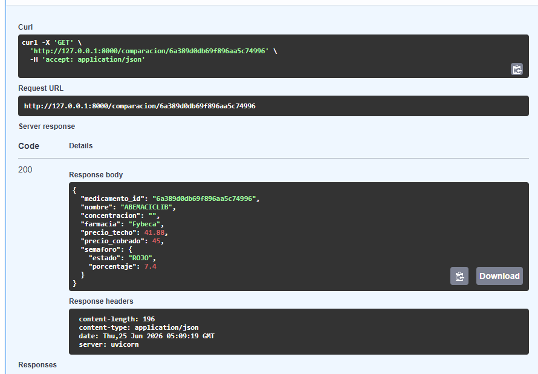
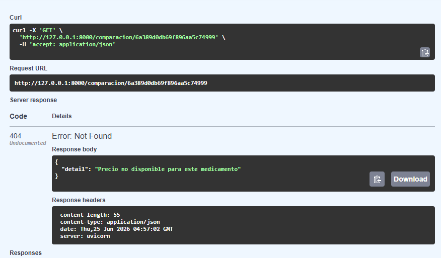
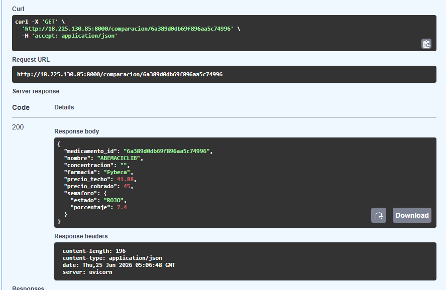
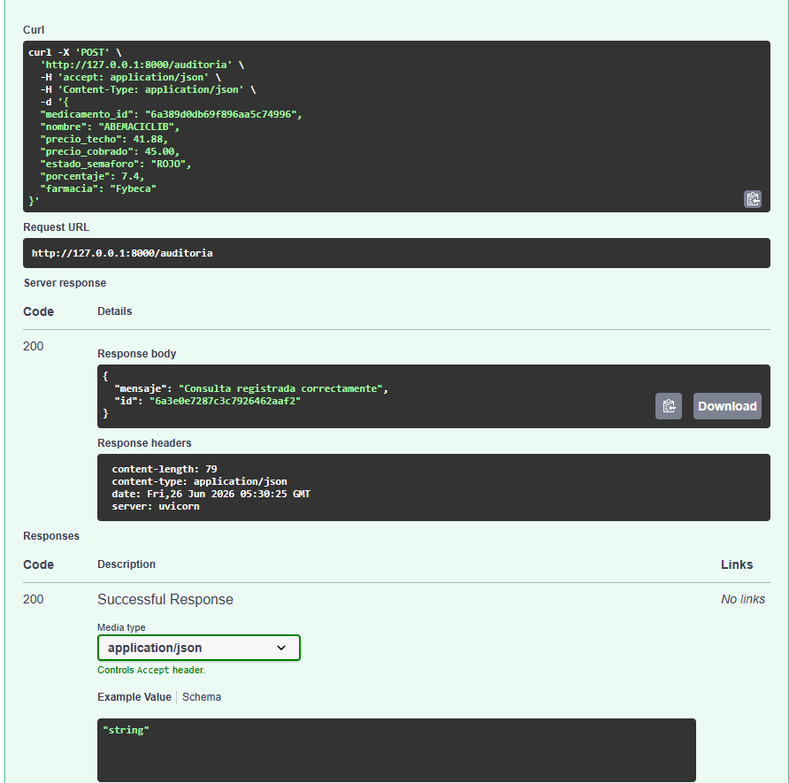
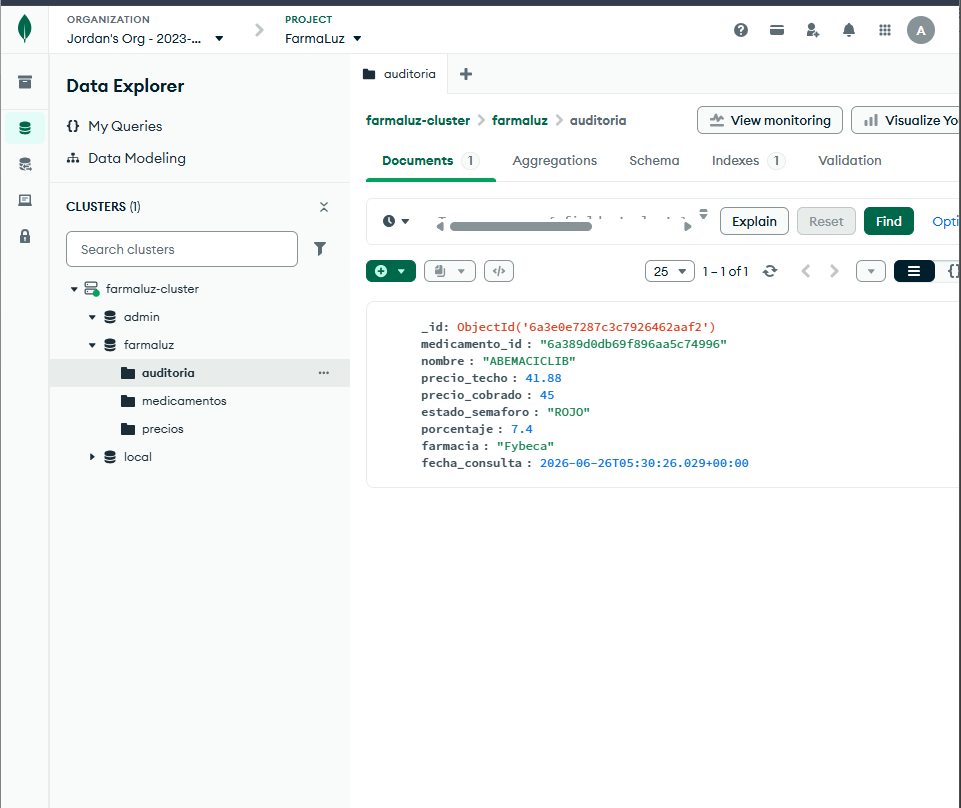

# Sprint 2 — Día 1 | Paspuezán Luis | Backend + DevOps

**Fecha:** Martes 23 de junio de 2026  
**Rama:** `feature/sprint2`

## ¿Qué hice hoy?

- Creé la rama `feature/sprint2` desde `develop`
- Implementé `backend/services/semaforo_service.py` con la función `calcular_semaforo()` que compara el precio cobrado contra el precio techo legal (CNFRPM/ARCSA) y retorna ROJO con porcentaje de sobreprecio o VERDE si está dentro del límite
- Creé el endpoint `GET /comparacion/{medicamento_id}` en `backend/routers/comparacion.py` que consulta la colección `medicamentos` de MongoDB Atlas y llama al semáforo
- Registré el router en `backend/main.py`
- Creé `.gitignore` (faltaba en el proyecto)
- Configuré el `.env` local y en EC2 con la `MONGODB_URI` correcta de Atlas
- Corregí el `WorkingDirectory` y el comando del servicio `systemd` para que use `backend.main:app` desde la raíz del proyecto
- Instalé `google-generativeai` en el venv local y en EC2
- Desplegué y verifiqué el funcionamiento en EC2

## Decisiones técnicas

- Se decidió leer el `precio_techo` directamente de la colección `medicamentos` (ya importada por Sanchez con 1,781 registros del CNFRPM/ARCSA) en vez de crear una colección `precios` separada, evitando duplicar datos
- Se usó búsqueda por loop en las claves del documento para encontrar `"Precio Techo (USD)"` porque el campo tiene espacios al final en MongoDB
- El endpoint es síncrono (no `async`) porque `pymongo` es síncrono

## Prueba realizada

Medicamento: **ABEMACICLIB**  
Precio techo: `$41.88`  
Precio cobrado: `$50.00`  
Resultado: `ROJO — 19.4% de sobreprecio` ✅

## Evidencia

## ¿Qué falta?

- Coordinar con Sanchez el formato exacto de los precios del scraper para integrarlo en el Día 2
- El endpoint actualmente recibe `precio_cobrado` como parámetro manual — en el Día 2 debe leerlo directamente del scraper en MongoDB

# Sprint 2 — Día 2 | Paspuezán Luis | Backend + DevOps

**Fecha:** Miércoles 24 de junio de 2026  
**Rama:** `feature/sprint2`

## ¿Qué hice hoy?

- Coordiné con Sanchez el formato exacto que debe tener la colección `precios` — se acordó agregar los campos `medicamento_id` y `nombre_buscado`
- Modifiqué el endpoint `GET /comparacion/{medicamento_id}` para que lea el `precio_cobrado` directamente de la colección `precios` en MongoDB, eliminando el parámetro manual de la URL
- Inserté un documento de prueba en la colección `precios` como contingencia mientras Sanchez entrega sus datos reales (Días 2 y 3 juntos)
- Validé el caso límite — cuando no existe precio para un medicamento el endpoint responde 404 con mensaje claro, no error 500
- Desplegué y verifiqué el funcionamiento en EC2

## Decisiones técnicas

- Se usó la **Opción B de contingencia** — datos simulados en `precios` para no bloquear el avance mientras Sanchez actualiza el scraper
- El endpoint busca en `precios` por `medicamento_id` — cuando Sanchez suba los datos reales funcionará automáticamente sin cambios en el código
- Se eliminó el parámetro `precio_cobrado` de la URL — ahora el endpoint es más limpio y realista para el frontend

## Prueba realizada

Medicamento: **ABEMACICLIB**  
Precio techo: `$41.88`  
Precio cobrado (Fybeca): `$45.00`  
Resultado: `ROJO — 7.4% de sobreprecio` ✅

Caso límite: ID inexistente → `404 Precio no disponible para este medicamento` ✅

## Evidencia

## ¿Qué falta?

- Recibir los datos reales de Sanchez (entrega Días 2 y 3 juntos mañana)
- Borrar el documento simulado de `precios` en Atlas
- Validar el flujo completo con precios reales del scraper

# Sprint 2 — Día 3 | Paspuezán Luis | Backend + DevOps

**Fecha:** Jueves 25 de junio de 2026  
**Rama:** `feature/sprint2`

## ¿Qué hice hoy?

- Creé el endpoint `POST /auditoria` en `backend/routers/auditoria.py` que registra cada consulta de comparación realizada con todos sus datos: medicamento, precios, resultado del semáforo y fecha
- Registré el router de auditoría en `backend/main.py`
- Verifiqué que el documento se guardó correctamente en la colección `auditoria` de MongoDB Atlas
- Verifiqué que Males aún no tiene los tests Pytest del semáforo — pendiente `tests/test_semaforo.py`
- Verifiqué que Chicaiza aún no conectó el frontend al endpoint `/comparacion/{id}` — pendiente coordinación

## Decisiones técnicas

- El endpoint `POST /auditoria` recibe los datos de la consulta desde el frontend — es Chicaiza quien debe llamarlo después de mostrar el semáforo al usuario
- Se usó `datetime.utcnow()` para registrar la fecha de consulta en UTC

## Prueba realizada

Registro de auditoría para **ABEMACICLIB**:
- Precio techo: `$41.88`
- Precio cobrado: `$45.00`
- Estado: `ROJO — 7.4%`
- Fecha: `2026-06-26T05:30:26` ✅

## Evidencia

## ¿Qué falta?

- Sanchez: subir datos reales con `medicamento_id` en colección `precios` y borrar documento simulado
- Chicaiza: conectar frontend al endpoint `GET /comparacion/{id}` y llamar a `POST /auditoria`
- Males: escribir tests Pytest para `calcular_semaforo()` en `tests/test_semaforo.py`
- Validar flujo completo con datos reales antes de merge a `main`