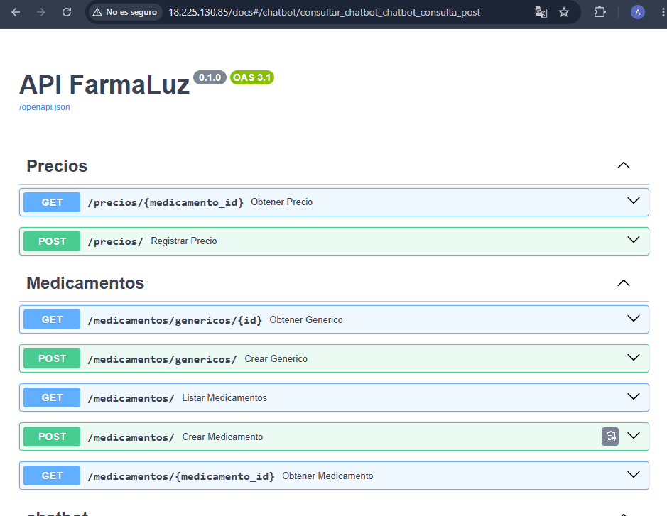
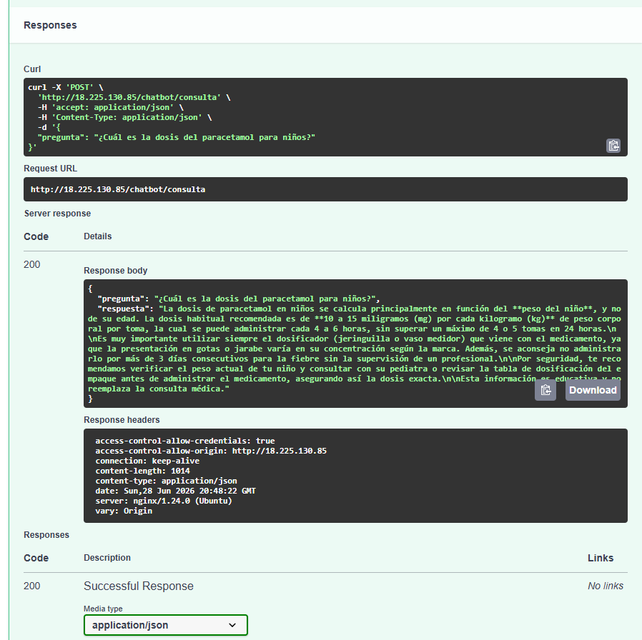
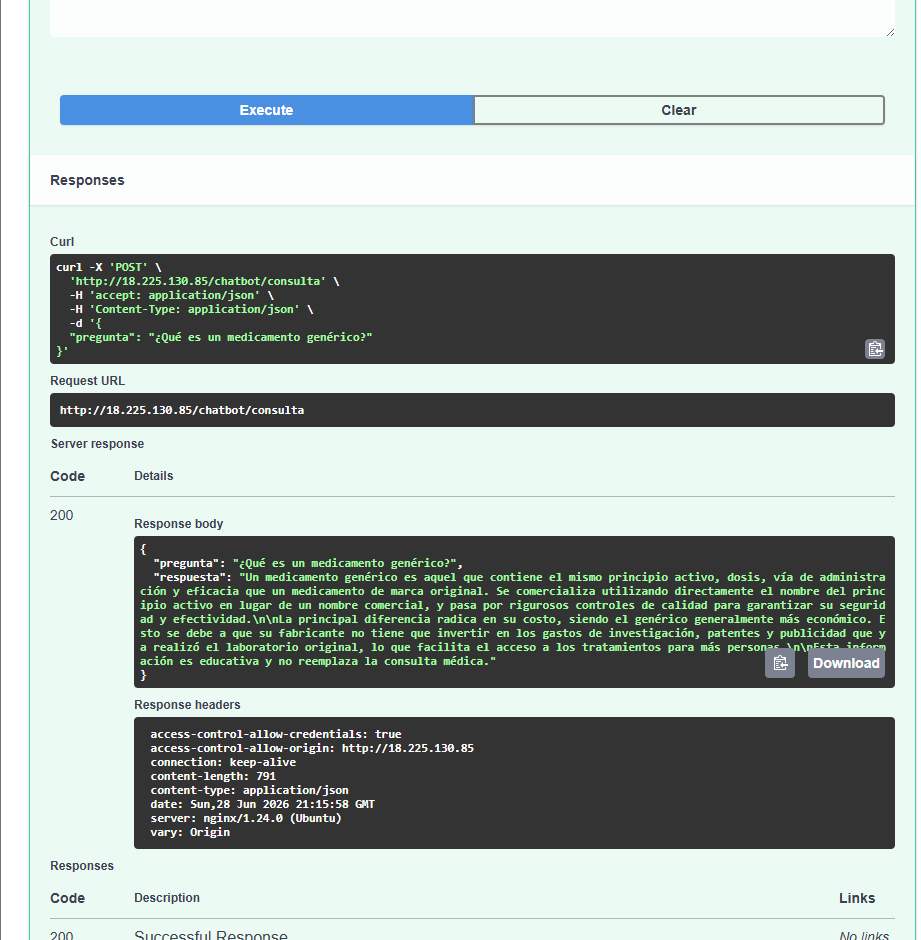

# Sprint 3 — Día 1 | Paspuezán Luis | Backend + DevOps

**Fecha:** Domingo 28 de junio de 2026  
**Rama:** `feature/sprint3`

## ¿Qué hice hoy?

- Revisé con Vela que `POST /chatbot/consulta` usa el prompt base real de `backend/chatbot/prompt_base.py` — confirmado, no es respuesta hardcodeada
- Identifiqué y corregí el modelo incorrecto en `gemini_service.py` (`gemini-3.5-flash` no existe — cambiado a `gemini-1.5-flash`)
- Eliminé el bloque de debug `client.models.list()` que se ejecutaba en cada petición
- Instalé la librería `google-genai 2.10.0` en el venv del proyecto (`backend/venv/`) — no estaba instalada
- Agregué `GEMINI_API_KEY` al `.env` del EC2 — faltaba completamente
- Corregí typo `GEMINI_API_KEy` → `GEMINI_API_KEY` en el `.env`
- Aumenté el timeout de Nginx a 120s en `/etc/nginx/sites-enabled/farmaluz` para evitar cortes 504
- Probé el endpoint con 3 preguntas distintas desde `/docs` de FastAPI
- Revisé logs del EC2 detectando y resolviendo 5 errores distintos

## Decisiones técnicas

- **No se usa timeout en `generate_content`** — la versión `google-genai 2.10.0` no acepta `timeout` como parámetro de `GenerateContentConfig`. El timeout se maneja a nivel de Nginx (120s)
- **El fallback de error se mantiene** — si Gemini falla por saturación (503) o cuota agotada (429), el endpoint responde con mensaje amigable en lugar de error 500. Decisión original de Vela, mantenida
- **`GEMINI_API_KEY` vive solo en el `.env` del EC2** — nunca se sube a GitHub

## Pruebas realizadas

**Pregunta 1 — Uso terapéutico (válida):**  
Pregunta: `¿Para qué sirve el ibuprofeno?`  
Resultado: Respuesta completa con uso, dosis y disclaimer ✅

**Pregunta 2 — Dosis pediátrica (válida):**  
Pregunta: `¿Cuál es la dosis del paracetamol para niños?`  
Resultado: Respuesta con dosis por peso corporal y disclaimer ✅

**Pregunta 3 — Definición de genérico (válida):**  
Pregunta: `¿Qué es un medicamento genérico?`  
Resultado: Respuesta educativa completa con disclaimer ✅

## Evidencia

## ¿Qué falta?

- Completar recorrido de todos los endpoints en producción (Día 2)
- Verificar que `.env` no esté expuesto en GitHub (Día 2)
- Reiniciar servicio desde cero y confirmar arranque limpio (Día 2)
- Documentar estado final de todos los endpoints (Día 2)
- Merge de `feature/sprint3` a `develop` (Día 2)