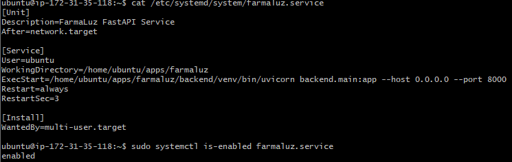
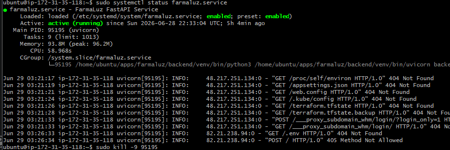
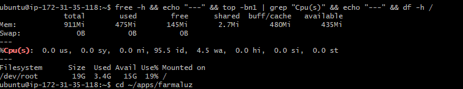
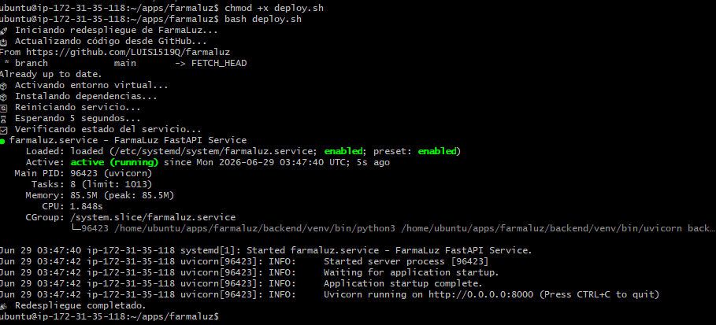

# Sprint 4 — Día 1 | Paspuezán Luis | Backend + DevOps
**Fecha:** Domingo 29 de junio de 2026
**Rama:** feature/sprint4

## ¿Qué hice hoy?
- Verifiqué la configuración del servicio systemd `farmaluz.service` — confirmado con `Restart=always`, `RestartSec=3` y estado `enabled`
- Probé recuperación automática del servicio matando el proceso con `kill -9` — systemd lo reinició solo en menos de 3 segundos
- Revisé uso de memoria y CPU de la instancia EC2 — métricas estables y dentro de límites seguros para la demo
- Creé y probé `deploy.sh` — script de respaldo para redespliegue rápido en caso de falla durante la demo

## Decisiones técnicas
- **No se modificó `farmaluz.service`** — el archivo ya tenía `Restart=always` y `RestartSec=3` correctamente configurados desde Sprint 1. No era necesario tocarlo
- **`deploy.sh` hace `git pull origin main`** — el script apunta a `main` porque en producción el EC2 siempre debe correr la rama estable. Durante la demo se hará el merge final a `main` antes del mediodía
- **Sin configuración de swap** — la instancia t3.micro tiene 911MB de RAM con 435MB disponibles. Configurar swap a horas de la demo representaba un riesgo innecesario; se monitorea manualmente si hay picos

## Métricas del servidor
| Métrica | Valor | Estado |
|---------|-------|--------|
| RAM usada | 475Mi / 911Mi (52%) | ✅ Estable |
| RAM disponible | 435Mi | ✅ Suficiente |
| CPU idle | 95.5% | ✅ Sin carga |
| Disco usado | 3.4G / 19G (19%) | ✅ Holgado |

## Pruebas realizadas

**Prueba 1 — Verificación de configuración systemd:**
- Comando: `cat /etc/systemd/system/farmaluz.service`
- Resultado: `Restart=always`, `RestartSec=3`, `enabled` ✅

**Prueba 2 — Recuperación automática tras caída forzada:**
- Acción: `sudo kill -9 95195`
- Resultado: systemd reinició el servicio con PID `96317` en menos de 3 segundos — `restart counter is at 1` ✅

**Prueba 3 — Deploy script:**
- Comando: `bash deploy.sh`
- Resultado: git pull, pip install, restart y status verificado — `🎉 Redespliegue completado` ✅

## Evidencia

## ¿Qué falta?
- Confirmar que el sistema completo está arriba antes del mediodía (Día 2)
- Ensayo completo de la demo con el equipo (Día 2)
- Tener plan B con capturas si EC2 falla en vivo (Día 2)
- Merge final `feature/sprint4` → `develop` → `main` (Día 2)
- Confirmar que el repositorio tiene todo: código, docs, diagramas, manuales (Día 2)