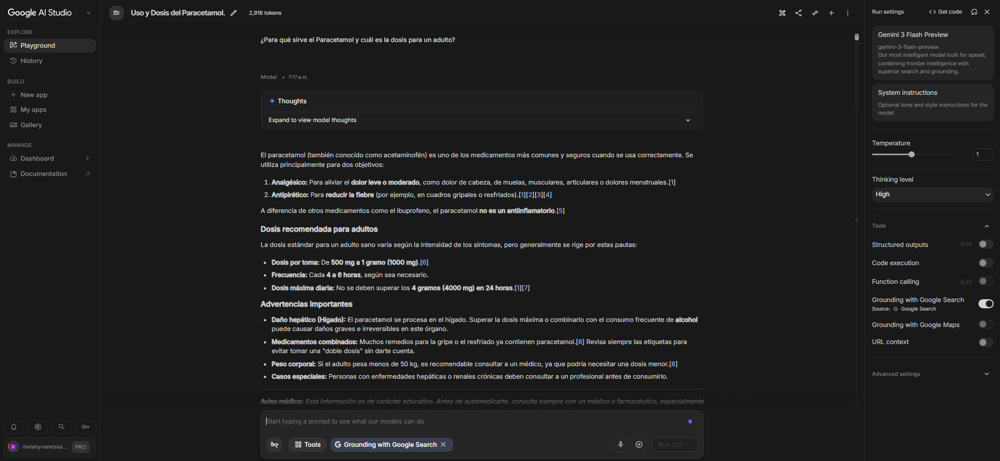
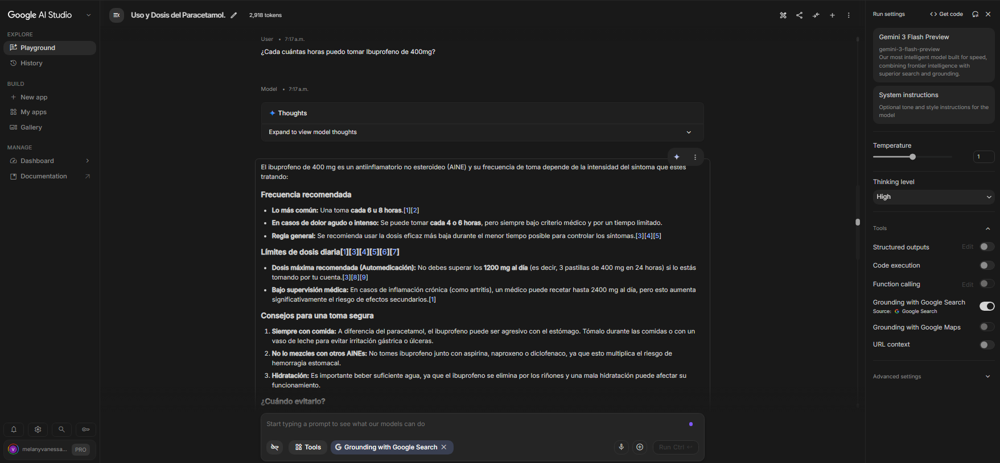
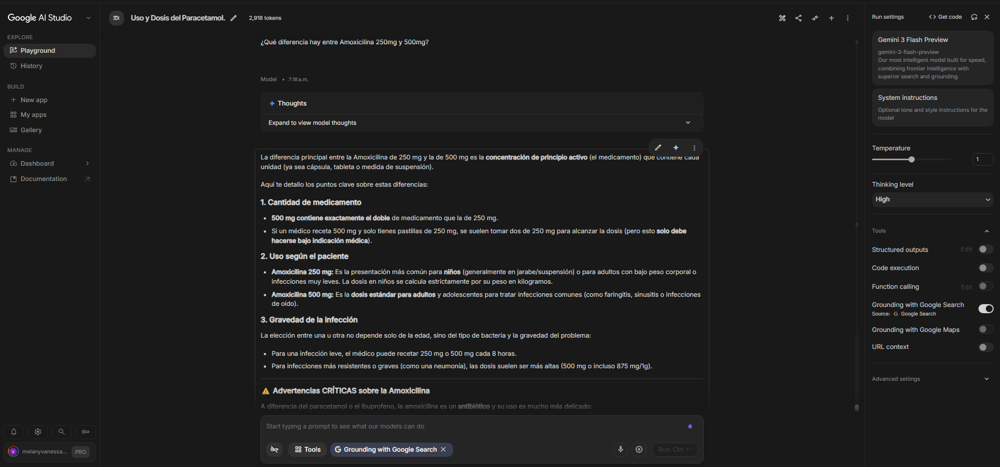
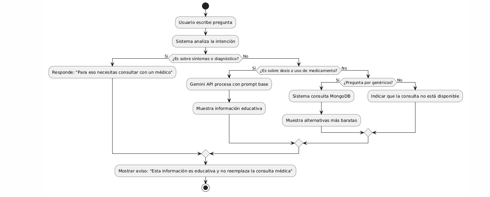

Sprint 0 — Documentación de Avance
Responsable: Vela Vanessa – IA + Chatbot
Fecha: 25 de junio 2026

Qué se hizo
Tarea 1: Validación de Inteligencia Artificial (Google AI Studio)
Acceso a la plataforma Google AI Studio configurado.

Ejecución de pruebas de comportamiento con preguntas de salud.

Resultados: Se verificó la capacidad del modelo para responder sobre dosis y usos de medicamentos básicos (Paracetamol, Ibuprofeno, Amoxicilina), obteniendo respuestas educativas iniciales.

Tarea 2: Definición del Prompt Base (Etica y Seguridad)
Creación del documento Prompt_Base_Chatbot_FarmaLuz.docx.

Definición de directrices de comportamiento: "Rol de asistente educativo", "Prohibición estricta de diagnóstico" y "Redirección a profesionales de la salud".

Estandarización de las listas de Lo que SÍ responde (dosis, principios activos, genéricos) vs Lo que NO responde (síntomas, recetas, diagnósticos).

Tarea 3: Diagrama de Flujo (PlantUML)
Diseño del flujo lógico del sistema mediante PlantUML.

Validación del flujo de toma de decisiones:

Input → Clasificación (dosis/uso vs. diagnóstico).

Rama A: Consulta API Gemini (Educativo).

Rama B: Respuesta predefinida de seguridad (Diagnóstico).

Rama C: Consulta MongoDB (Genéricos).

Salida: Aviso legal obligatorio.

Evidencia
Capturas: prueba_gemini_1.png, prueba_gemini_2.png, prueba_gemini_3.png.
  

Documento: Prompt_Base_Chatbot_FarmaLuz.docx (Incluye ejemplo de conversación técnica).

Diagrama: diagrama_flujo_chatbot.png (Exportado desde PlantUML).

Entregables completados
✅ Cuenta en AI Studio activa.

✅ Documento de Prompt base con reglas de seguridad.

✅ Diagrama de flujo del chatbot (PlantUML) diseñado y exportado.

✅ Evidencia de pruebas iniciales con Gemini.