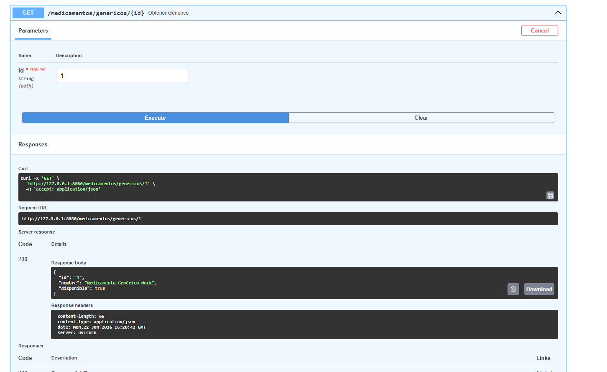
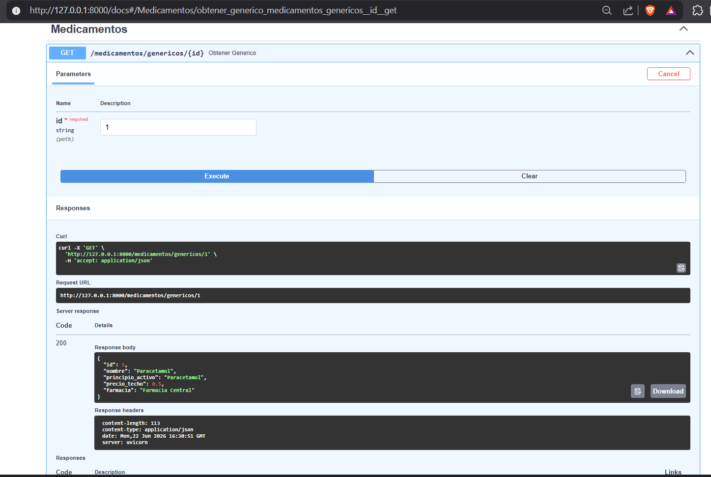

Sprint 1 — Documentación de Avance
Responsable: Vela Vanessa – IA + Chatbot
Fecha: 20 - 22 de junio 2026

Día 1 — 20 de junio 2026
Qué se hizo
Configuración del SDK: Se obtuvo la API Key de Google Gemini en AI Studio y se configuró como variable de entorno GEMINI_API_KEY en el archivo .env.

Instalación de dependencias: Instalación de google-generativeai y langchain en el entorno virtual del backend.

Arquitectura del módulo: Creación de la estructura del módulo chatbot/ incluyendo gemini_service.py, prompt_base.py y routers/chatbot.py.

Prompt Base: Migración de las reglas de seguridad y comportamiento definidas en el Sprint 0 hacia el archivo prompt_base.py.

Día 2 — 21 de junio 2026
Qué se hizo
Endpoint de Chat: Implementación del endpoint POST /chatbot/consulta con una estructura inicial que recibe un objeto JSON pregunta y retorna una respuesta fija de prueba para validar el ruteo.

Modelo de Datos: Definición del esquema para Genéricos en MongoDB, incluyendo campos esenciales: nombre, principio_activo, precio_referencial y laboratorio.

Endpoint de Datos: Creación de la estructura base GET /genericos/{medicamento_id} utilizando datos mock para validar la conexión.

Integración: Conexión de los nuevos routers al main.py principal del sistema.

Día 3 — 22 de junio 2026
Qué se hizo
Conexión Real: Implementación de la función obtener_respuesta_gemini en gemini_service.py, integrando el prompt_base con la consulta dinámica del usuario.

Validación: Ejecución de pruebas reales desde el endpoint /chatbot/consulta.

Seguridad: Verificación de que la IA respeta el blindaje ético (rechazo de diagnósticos médicos y redirección a consulta profesional).

Repositorio: Subida de avances a la rama feature/sprint1 y notificación al líder técnico (Paspuezán) sobre la disponibilidad del módulo para futuras integraciones.

Entregables completados
✅ Gemini SDK instalado y API Key configurada.

✅ Estructura del módulo chatbot creada y operativa.

✅ Endpoint POST /chatbot/consulta funcional con lógica de IA.

✅ Endpoint GET /genericos/{id} con estructura base definida.

✅ Prueba real documentada con capturas de respuesta de la IA.