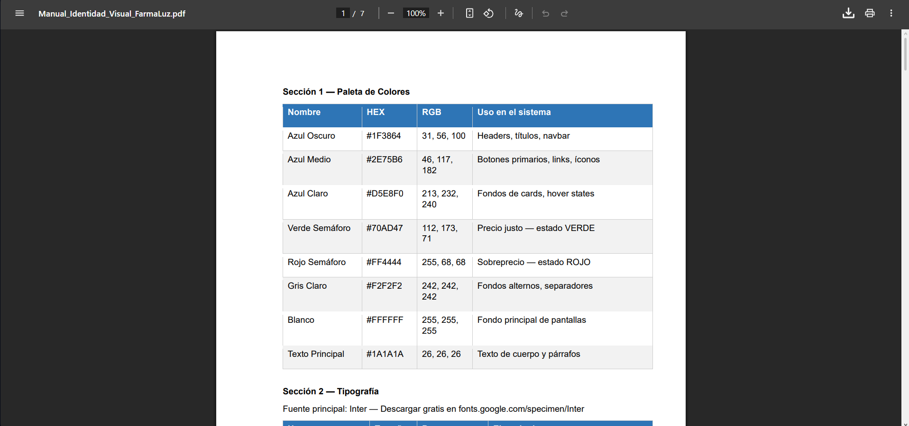
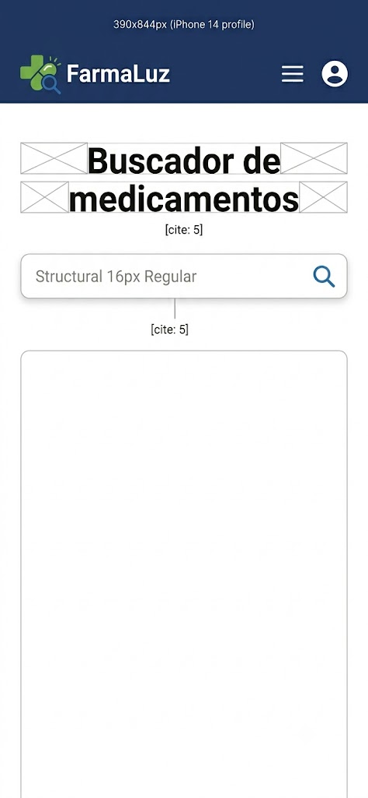
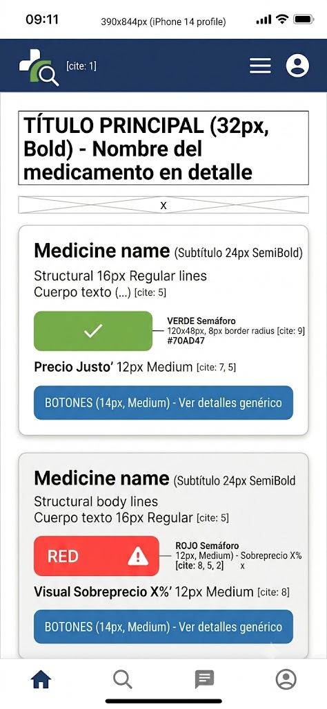
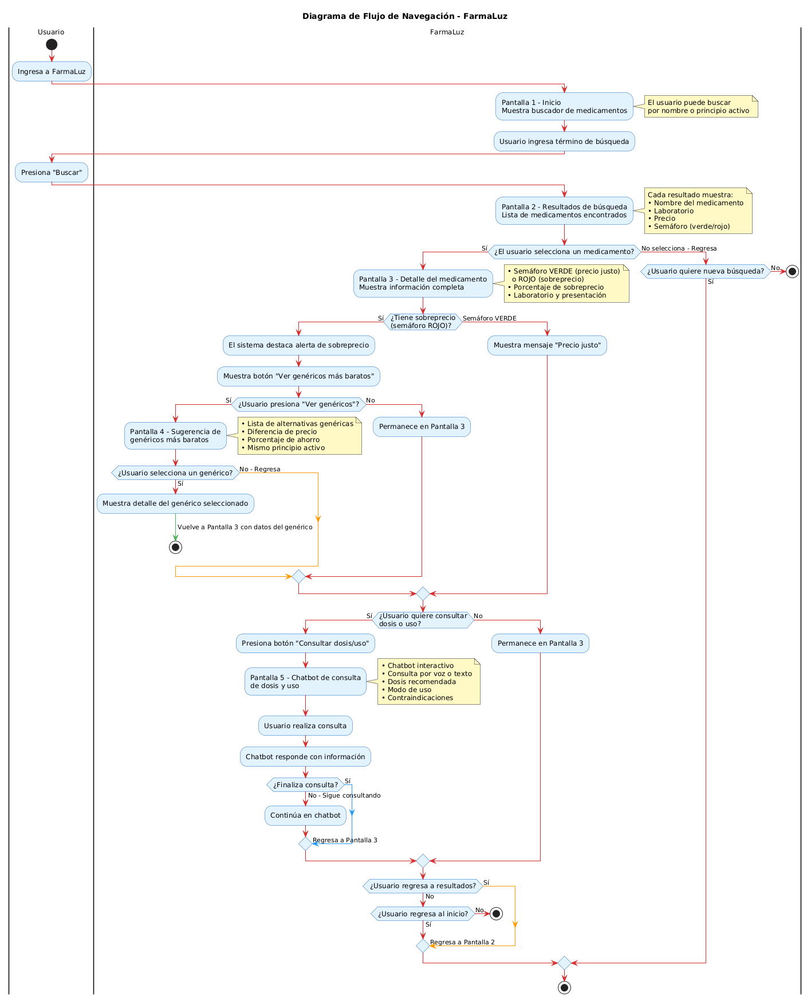

Sprint 0 — Documentación de Avance

Responsable: Alex Chicaiza – Frontend
Día 1 — 19 de junio 2026

Qué se hizo

- Manual de Identidad Visual corporativa creado y exportado (Word y PDF)
- Logo principal del proyecto diseñado (logo_farmaluz.png)
- 5 pantallas base (wireframes/mocks) generadas en Figma (Buscador, Resultados, Semáforo, Genéricos, Chatbot)
- StyleGuide oficial creado en Figma con la paleta de colores y tipografía Inter
- Diagrama de flujo de navegación de la interfaz diseñado (flujo_navegacion_ui.png)
- Archivos de diseño subidos al repositorio en docs/identidad-visual y docs/diagramas
- Tareas marcadas como completadas en Huly (FLZ-8 a FLZ-13) con links de evidencia

Entregables completados

✅ Flujo de navegación
✅ Manual Identidad Visual
✅ 5 pantallas base
✅ StyleGuide Figma

Evidencia — Día 1

